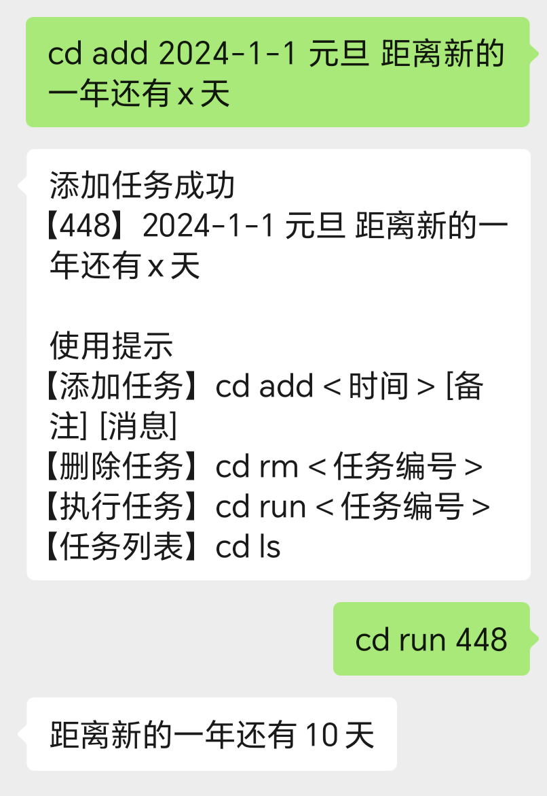
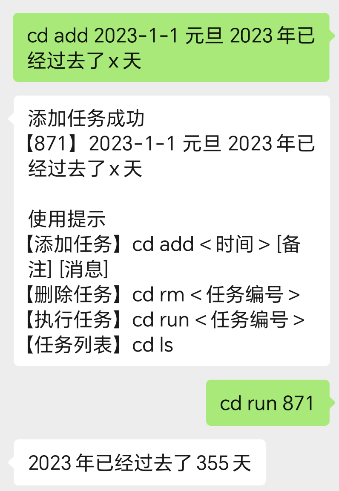
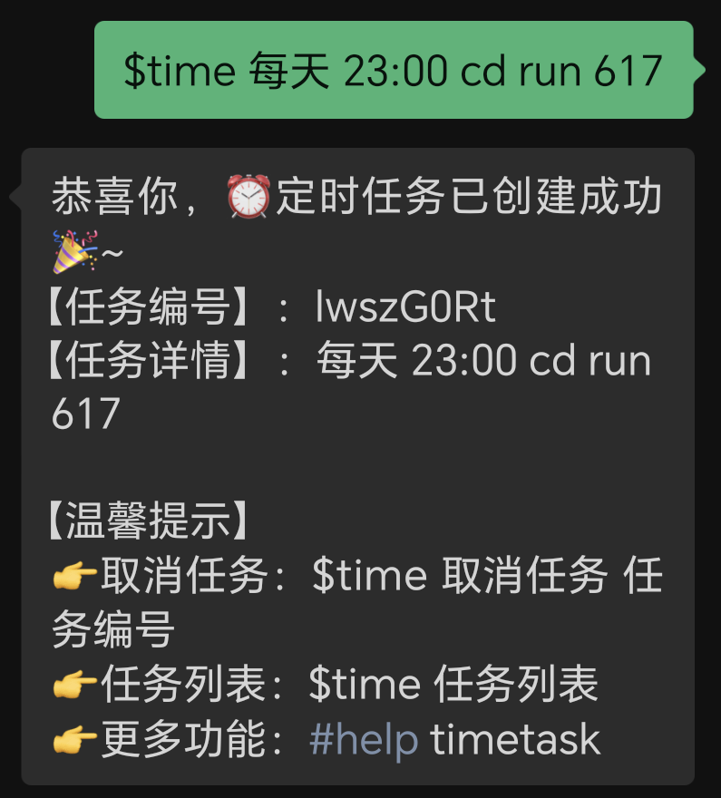

# Countdown 倒计时
本插件基于[ChatGPT-on-Wechat](https://github.com/zhayujie/chatgpt-on-wechat)项目，支持倒数日与纪念日的自定义消息播报

本插件参考[timetask](https://github.com/haikerapples/timetask)开发，建议与[timetask](https://github.com/haikerapples/timetask)插件配合使用

# 演示
### 倒数日

### 纪念日

### 与timetask配合使用

### 定时播报自定义倒计时消息

# 用法
```
【添加任务】cd add <时间> [备注] [消息]
<时间> 必选 目标日期 格式为“年-月-日” 如“2023-12-1” 
[备注] 可选 该任务的备注 如“考试倒计时”
[消息] 可选 该任务的消息 如“距离考试x天” 使用“x”占位
例:cd add 2023-12-1 考试倒计时 距离考试还有x天      

【删除任务】cd rm <任务编号>
例:cd rm 001

【执行任务】cd run <任务编号>
例:cd run 001

【任务列表】cd ls
例:cd ls
```

# 安装
- 直接安装
将下载的插件文件夹Countdown放在plugins文件夹中，会被chatgpt-on-wechat自动扫描加载

- 通过Godcmd插件安装
```
#installp https://github.com/lingmaple/Countdown
#scanp
```
